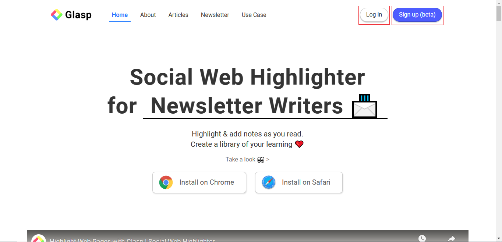
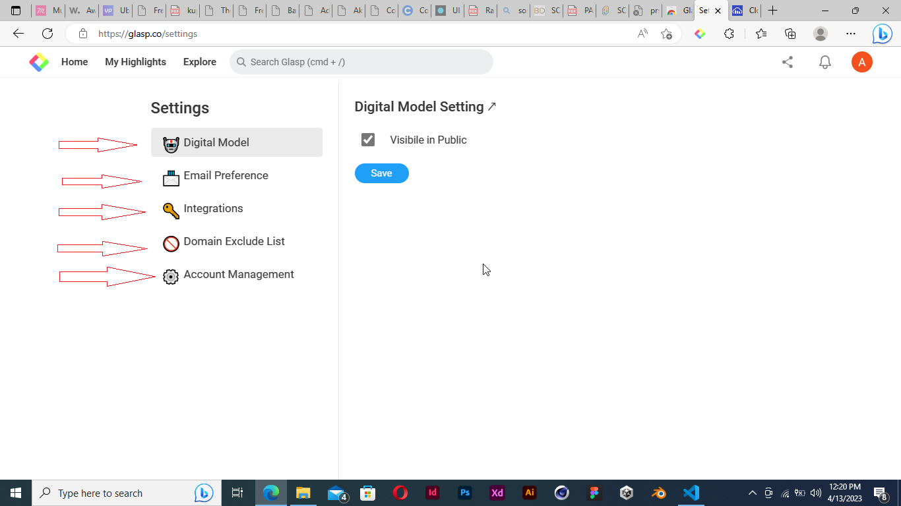

## TABLE OF CONTENT
- All you need to know anout Glasp
- Purpose of this article
- Overview of Glasp
- How to sign up on Glasp
- How to navigate through Glasp
- How to create your own highlight
- How to share and export highlights to other platforms
- Conclusion
- Resources

## ALL YOU NEED TO KNOW ABOUT GLASP

Have you found yourself in a situation where you are reading an article online and suddenly, a sentence or a post resonates with you? 
You wish you could save that post but the only option is to save it in your notepad which you could easily lose if you mistakenly delete it or lose your device. 

Or you find yourself researching on a topic and you wish to save a section of the article so as to revert back to it later?

Maybe you are a tutor or a lecturer and you would love to quote some section of an article as a reference to your students, but you wish you could access all of the quoted posts in one medium.

what if i told you, there is a tool that can help you collate all of these posts into one medium for easy accessibility. 

and even better, you can share those quoted posts to different external sources with ease.

Now that i have your attention, stay with me as i onboard you on how Glasp can be of help to you. 

# PURPOSE OF THIS ARTICLE
This article makes an attempt to enlighten you on what Glasp can do for you, how to access the tool, how to perform specific tasks with it, how to navigate your way around the tool, and how it would make your life easier as a reader or writer.

## OVERVIEW OF GLASP
Glasp is a web extension tool that makes content easily accessible to readers. it serves as a medium through which writers, avid learners, and everyday people can save website content they find appealing easily without having to make use of an external medium which in most cases, could be mistakenly deleted or lost due to unforeseen reasons. It allows you highlight, and save notes in one central location thereby, creating a personalized and centralized library. It also makes it easy for you to highlight on transcript, and add notes on youtube videos easily. easy integration with kindle, quoteshots made easy for sharing on social media platforms, AI powered summary gotten from your highlights and note algorithm, works seamlessly with PDF files while supporting highlight and annotating feature. 

and it gets better, Glasp lets you easily embed your quotes in blogspots or newsletters, and it allows you download your saved highlights in different formats which could be in *.txt , .md or .csv* file format.

It should however be noted that Glasp is only available on the following web browsers at the time of writing this article: Chrome, Brave, Microsoft edge, and Safari. 

## HOW TO CREATE A NEW ACCOUNT ON GLASP
Getting access to the Glasp tool is quite easy as i will show you how to create your own account in four easy steps. Glasp integrates their platform with a solitary mailing address which is Gmail. so all you need to do to get started is to create your personal Gmail account and you are half way into making use of the highlight toolS. Then follow the steps below afterwards:

- input Glasp.co in your desktop browser. 
 

- locate and click the Log-in OR Sign up(beta) tab at the top right hand corner. 

- An overlay opens prompting you to proceed with your login by clicking the _continue with Google_ button. 

- Select your Gmail account if it's already logged in on the browser, otherwise; you will have to login to your Gmail account to proceed by clicking the tab an arrow is pointing towards. 

- Now that you have an account on Glasp, you will be asked to install Glasp browser extension.
- Click on the "Get" tab > "Allow" tab > then "Add extension". 

- Head to your extension icon on your browser which is marked with a rectangle, and toggle the "show" icon so as to make your Glasp extension easily accessible to you. 

- Once you are done adding Glasp extension to your browser toolbar, this home screen is displayed with the right pane showing you that the extension is active. you can choose to click the Home tab to access the main screen. 

## HOW TO NAVIGATE THROUGH GLASP
Once you are able to access your Glasp account after login in, you are prompted to choose up to 10 topics of interest of your choice before you can proceed.

The Glasp algorithm curate articles to be displayed on your timeline. Afterwards, you cam toggle between these three options "Following", "Topics", and "Popular" for articles.

- You can view an highlight by clicking on any of the articles displayed and then keep an eye on the changes on the right hand side of your screen. 

- You can also save an highlight by clicking on the *Add to saved item* icon just at the top right corner of the content border. 

- When you click on your user profile, you are shown different options which includes Ask your Digital Me, Talk to founders, Settings, joining a slack community, Kindle Export, Find Like minds, Browser Extension, Tutorial Video, FAQs, Bug Report, and Sign out.

- You can view your notifications by clicking the bell icon placed between your user profile and input field. 

- You can search for highlights by entering your search text in the input field provided. it also suggests pages. associated with search keyword with you.

- You can view your dashboard by clicking "See your highlight" under your name or click "my highlights" on the navigation tab. 

- You can edit your profile by clicking on your profile picture on the home screen, then click "see your highlight". Afterwards, click the three vertical dot placed beside your full name and then edit your details. After you are done editting, click the save button and your changes become effected.
.png "Click the three-vertical dot placed beside your full name")
.png "Change your details and then click the "save" button")

- To access FAQs, Click on your user profile > click FAQs. 
.png "Click the login or sign up button")
.png "You can then proceed by going through the Frequently Asked Questions List")

- To access Glasp tutorials, Click your profile picture > click "Tutorial Video" and then it takes you to a YouTube. page

- Do you have a suggestion on how to make Glasp better? talk to the founder in 3 steps. Click your profile picture > click "Talk to founders" > schedule a meeting. 

- Would you like to report a bug you encountered while using Glasp? you can fill in your complaint by following these steps. Click your profile picture > click "Bug report" > fill complaint and submit. 

- Do you want to locate users who have a common interest as you? Click your profile picture > click " Find Like minds" > click "Find content from community" before making use of the search feature and options provided. 

- To access your settings, Click your profile picture > click "setings" > you can then toggle between "Digital Model", "Email Preference", "Integration", "Domain Exclude List", and "Account Management". 

- To join Glasp slack community, Click on your profile picture > Click "Glasp community". 

- To export your highlight via Kindle, Click on your profile picture > click "Kindle Export". 

- To sign out from Glasp, Click on your ptofile picture > Click "Sign out". 

## HOW TO CREATE YOUR OWN HIGHLIGHT
To create a new highlight and have it stored in a central location like Glasp, You should follow this step. 

- By now, you must have installed Glasp extension on your browser, click the Glasp icon on the browser extension toolbar to open Glasp sidebar. 

- head to any website of your choice you wish to extract a certain quote, sentence or post, select the quote by right-clicking with your mouse from the start of the quote all the way to where the highlight should end, as soon as you are done highlighting; a popup displaying different colors is displayed. 

- Select your prferred color and immidiately you do this, you will notice your selected sentence has been highlighted in your choice of color and addded to the Glasp sidebar on your right. 

## HOW TO SHARE AND EXPORT HIGHLIGHTS TO OTHER PLATFORMS
- Go to your profile section and click "See your highlights" or click on "My highlight" on the navigation menu or select another users' article you wish to share. 
- Select an article you want to share/export, then click "share icon" on the botttom right of the highlight > select any of the two options provided. 

- head down to which platform you want to share the highlight and paste the link you just copied earlier. 

- Now you have sucessfully shared/exported the article. 

## CONCLUSION
The aim of Glasp is to make life easier for you by providing you a centralised point where you can keep track of all the information or content that appeals to you without having to go through the stress of Copy/Paste post from the internet to your notepad. as a lot of things could go wrong which would make you lose those vital information.

## RESOURCES 
- [How to export web articles](https://medium.com/glasp/tutorial-how-to-export-web-articles--sentences-into-notion-907571bd5050)
- [How to embed glasp highlights on note-taking applictions and websites](https://medium.com/glasp/how-to-embed-glasp-highlights-on-note-taking-apps-websites-23db1381901e)
